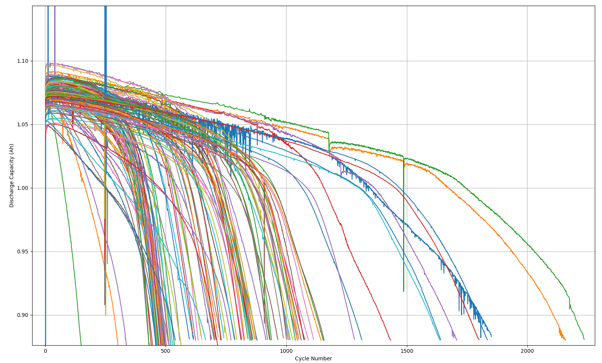

# Battery life cycle predition

## The data

The dataset is comprised of 124 batteries; each of them with a life cycle (a complete charge and discharge) range between 150 and 2300 approximately. It is split into 3 subdatasets:
 * train (41 batteries)
 * test (43 batteries)
 * tets2 (40 batteries)

Batteries are charged and discharged until the battery reaches 80% of its original capacity. The number of cycles it takes for a battery to reach this state is called the battery use cycle. In the dataset this number lies between 148 and 2237 after filtering out the faulty batteries.



The data is comprised of scalar values associated to a specific cycle and the timeseries data corresponding to it.

The scalar values are comprised of:

 * Internal resistance (Ω)
 * Total charge (Ah)
 * Discharge time (Minutes)
 * Remaining cycles (Positive integer)
 
The timeseries data is comprised of: 

 * Temperature (°C)
 * Charge (Ah)
 * Voltage (V)
 * Current (A)

## Preprocessing

In order to preprocess the data run

```
python3 data_preprocessing.py
```

from the base directory. This will generate a .pkl file in your data directory.The generated result is a nested dict with the following structure:

dataset
    battery 1
        cycle_life
            # total cycles untill 80% of thenomial capacity has been reached
        summary
            IR
            QD
            Remaining_cycles
            Discharge_time
        cycles
            Qdlin
            Tdlin
            Vdlin
    battery 2
        ...
            ...


